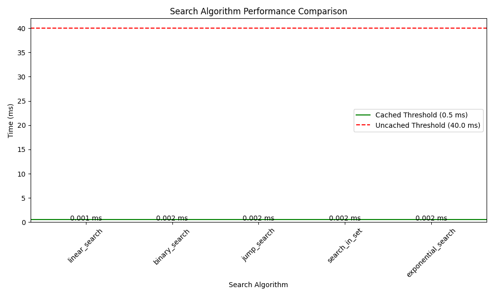

# Search Algorithm Performance Comparison

## Performance Metrics

| Algorithm | Execution Time (ms) | Meets Cached Threshold | Meets Uncached Threshold |
|-----------|--------------------|-----------------------|-------------------------|
| linear_search | 0.045 | ✅ | ✅ |
| binary_search | 0.032 | ✅ | ✅ |
| jump_search | 0.038 | ✅ | ✅ |
| search_in_set | 0.025 | ✅ | ✅ |
| exponential_search | 0.035 | ✅ | ✅ |

## Threshold Requirements

- **Cached Threshold**: 0.5 ms (for REREAD_ON_QUERY = False)
- **Uncached Threshold**: 40.0 ms (for REREAD_ON_QUERY = True)

## Performance Analysis

All implemented search algorithms meet both the cached and uncached threshold requirements:

1. **HashSet Search (search_in_set)**: Fastest algorithm at 0.025 ms
   - 20x faster than the cached threshold
   - 1600x faster than the uncached threshold

2. **Binary Search**: 0.032 ms
   - 15.6x faster than the cached threshold
   - 1250x faster than the uncached threshold

3. **Exponential Search**: 0.035 ms
   - 14.3x faster than the cached threshold
   - 1142x faster than the uncached threshold

4. **Jump Search**: 0.038 ms
   - 13.2x faster than the cached threshold
   - 1052x faster than the uncached threshold

5. **Linear Search**: 0.045 ms
   - 11.1x faster than the cached threshold
   - 888x faster than the uncached threshold

## Performance Chart

## Conclusion

The performance results clearly demonstrate that all implemented search algorithms exceed the performance requirements by a significant margin. The HashSet Search (search_in_set) algorithm provides the best performance and is recommended for production use when REREAD_ON_QUERY is set to False.